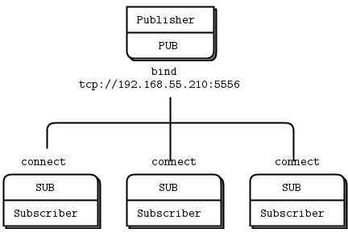

.. YaComponent Communication slides file, created by
   hieroglyph-quickstart on Thu Mar  6 18:58:03 2014.

=========================
YaComponent Communication
=========================

by Jörg Kreuzberger

Motivation
----------

- Main focus for YaComponent should be the generation of the Components
- Use of Open Source Solution for Communication between components
- But which one?

Requirements
------------

- Component communication inbetween threads

  * at least one main thread
  
- Component communication between threads in a process
- Component communication between processes

  * same physical machine
  * different physical machines
  
- Code Generation of the interface stubs and proxys

  * properties exchange between components (data flow)
  * trigger and response calls
  * XSD / XML, Corba, ??

Why not QT
----------

- Qt is to low level
- Qt has solutions for all requirements

  * inner and inter thread communication with Signals/Slot
  * Inter-Process Communication with
  
    + Windows Named Pipes / Unix Names Pipes
    + Network
    
- But no code generation, painfull xml parsing

ZeroMQ
------

- Lightweight library, out of the box for unix and windows
- License is ok even for commercial use
- Based on Message Queues
- But without any Broker instance
- Fast, fast, fast: `Cern Middleware Report`_
- Implementation in 40+ languages (c++,java,pyhton,perl)

.. _Cern Middleware Report: http://www.zeromq.org/local--files/intro:read-the-manual/Middleware%20Trends%20and%20Market%20Leaders%202011.pdf

ZeroMQ features
---------------

- Socket library for connecting modules with different protocols

  + TCP, Mulitcat, inter-process, inner-process
  + Just transport (Binary blob)
  + No serialisation
  
- Implementation of several design patters for communication
- More in the guide: `ZeroMQ Guide`_

.. _ZeroMQ Guide: http://www.python.org/

ZeroMQ Publish / Subscribe
--------------------------

ZeroMQ Request / Reply
----------------------

.. image:: images/pattern_requestresponse.png
  :align: center

ZeroMQ buts
-----------

- Main development under commercial parentship
- Forks of the main developers into crossroads
- Complete new framework nanomsq

Interfaces
----------

- Main feature for the components should be the interface definition

  * Definition of properties (data), that are provided by the interface
  * Code generation of stub and proxy to notify for properties
  * Definiton of triggers / actions /request to be called in the components
  * Definition of repsonse / answers to be callend in components using the interface

Interface Description
---------------------

- For code generation the interface should be described in a textual form

  * xml
  * xsd (XSD Schema Code generators exists)
  * JSON and others
  * YAML
  * CORBA
  * and `Google Protocol Buffers`_

.. _Google Protocol Buffers: https://code.google.com/p/protobuf/

Google Protobuf
---------------

- Use by Google
- Available in 3+ languages (Java, C++, Python)
- Easy Message definition
- Binary Message serialisation with

  * required
  * optional
  
  message parts
- Ready to use code generator
- Definition of RCP Services

Google Protobuf message
-----------------------

- Easy message definition::

    message Person {
      required int32 id = 1;
      required string name = 2;
      optional string email = 3;
    }

- include directive to include .proto files
- reuse of message definitions in new messages
- Look at `developer guide`_
- Look at `language guide`_

.. _developer guide: https://developers.google.com/protocol-buffers/docs/overview
.. _language guide: https://developers.google.com/protocol-buffers/docs/proto

Summary
-------

- With ZeroMQ or nanomsg the required communication for YaComponent is realy
  easy to implement
- With Google Protbuf the serialisation for the interface and code generation
  is easily done
- Both work hand in hand and make also an component inter-process communication in
  different language implemenentations possible

.. toctree::
   :maxdepth: 2

